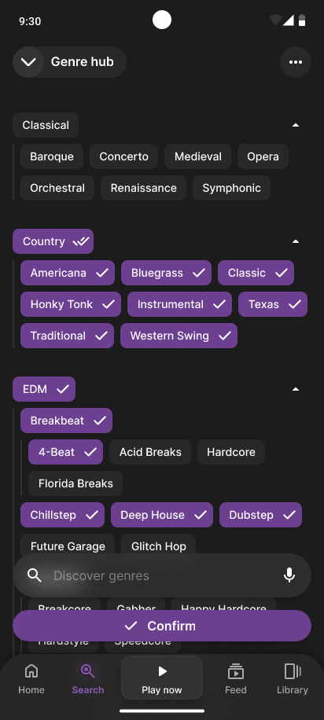
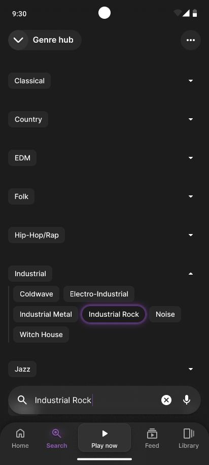
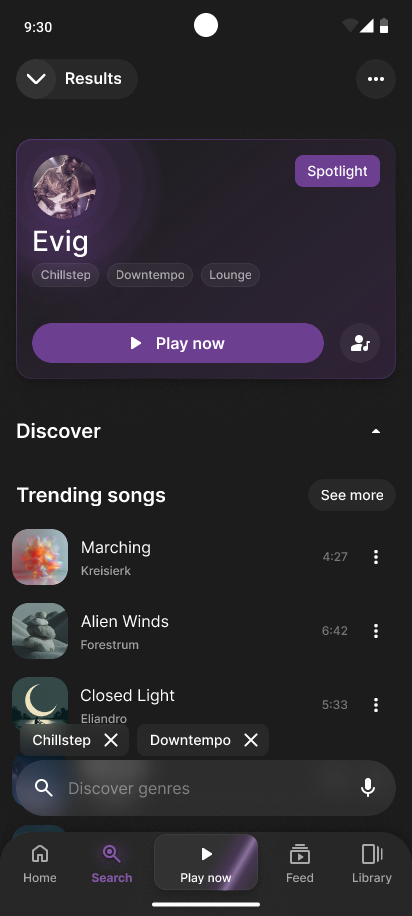

# Sona | genre-based music app

# 🞂 Project Overview

### Concept

**Sona** is a premium music streaming experience designed for the music enthusiast, the individual who understands the intricate web of **genres and sub-genres** that define it. In an era where algorithmic playlists often flatten the musical landscape, Sona restores the joy of intentional discovery through a robust, genre-focused interface.

### Why Sona?

I noticed a growing disconnect between modern streaming platforms and the users who crave deeper organization. While current apps excel at passive discovery, they often bury the specific genre data that enthusiasts use to categorize their playlists.

To validate this, I conducted a **user questionnaire** among friends and colleagues to identify their primary frustrations with existing services. The results were clear:

- **The Top Pain Point** -
A significant majority of respondents identified the **inability to search for or explore genres in an organized, hierarchical fashion** as a primary friction point in their daily use.
- **The Problem** -
Users felt that genres were treated as flat buckets rather than complex trees, making it difficult to find niche sub-genres (like *Djent*, *Fusion-Jazz* or *Hardstyle*) without knowing the specific artist name first.

### Solution

Sona was born from the need to turn metadata into a first-class citizen. My goal was to create a cohesive environment that balances dense information with intuitive navigation:

- **Intelligent Taxonomy** -
I developed a unified **Genre Hub** that visualizes the relationship between parent categories and niche sub-genres. This system is powered by a "Hierarchy-Aware" search: when a user searches for a specific sub-genre, the interface automatically expands the relevant parent category while collapsing others, utilizing visual effects to provide immediate focus on the result.
- **Interactive Tags** -
To ensure discovery is never more than a tap away, I implemented a system of **Genre Pills** across many components of the app. Whether browsing an Artist page, looking at Playlist cards, or viewing the Search page, these interactive chips highlight the specific sub-genres of the content, allowing users to pivot their discovery journey instantly from any screen.
- **Dynamic Tab** -
I replaced the traditional static playback bar with an expanding tab system anchored in the global navigation. This maintains the user’s "Sense of Place" while browsing; a simple upward gesture expands the playback view, while a pulsing empty state loop animation acts as a subtle CTA to keep the music flowing.

# 🞂 Genre Hub

<table style="width: 100%; border-collapse: collapse;">
  <tr>
    <td style="width: 33%; border: none;">
      
    </td>
    <td style="width: 33%; border: none;">
      
    </td>
    <td style="width: 33%; border: none;">
      
    </td>
  </tr>
</table>

The **Genre Hub** is the core of the Sona experience. It addresses the primary user frustration identified in my research: the lack of meaningful genre organization in modern streaming apps.

### Multi-Selection Exploration

The hub is built on a hierarchical tree model that allows users to drill down into complex musical lineages.

- **Intuitive Hierarchy** -
Users can expand parent categories to reveal curated sub-genres, maintaining a clean interface while providing massive depth. Sub-genres can also behave like parents hosting other sub-genres themselves.
- **Mass Selection** -
Interactive chips allow for quick multi-selection. Users can select an entire parent category or cherry-pick niche sub-genres to create highly specific discovery results.

### Hierarchy-Aware Search

To streamline the discovery of niche genres, the search function within the hub is contextually aware of the app’s taxonomy.

- **Auto-Expansion** -
When a user types a specific term the system automatically collapses irrelevant categories and expands the found parent or child genre.
- **Visual Focus** -
The targeted result is highlighted, creating a clear visual anchor that guides the user’s eye directly to their search intent.

### Transition to Discovery

Once the selection is confirmed, the app transitions into a results state that maintains the Genre First philosophy.

- **Dynamic Results** -
The search results page doesn't just show songs; it prioritizes "Spotlight" artists and trending content that matches the specific genre fingerprint the user just created.
- **Persistent Context** -
The selected genre filters remain visible as interactive dismissible chips at the bottom of the screen, allowing users to tweak their selection without losing their place in the discovery scroll.
